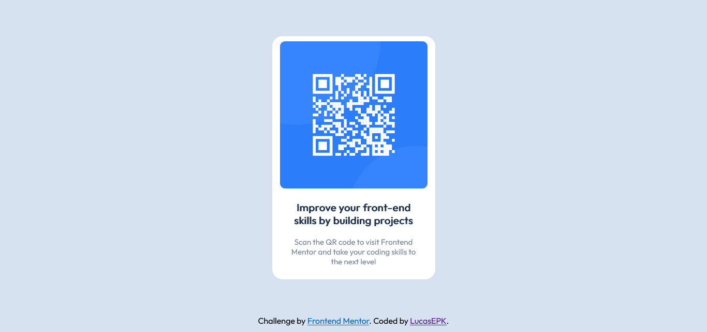

# Frontend Mentor - QR code component solution

This is a solution to the [QR code component challenge on Frontend Mentor](https://www.frontendmentor.io/challenges/qr-code-component-iux_sIO_H). Frontend Mentor challenges help you improve your coding skills by building realistic projects. 

## Table of contents

- [Overview](#overview)
  - [Screenshot](#screenshot)
  - [Links](#links)
- [My process](#my-process)
  - [Built with](#built-with)
  - [What I learned](#what-i-learned)
  - [Continued development](#continued-development)
  - [Useful resources](#useful-resources)
- [Author](#author)

## Overview

### Screenshot



### Links

- Live Site URL: [https://lucasepk.github.io/QR_website/](https://lucasepk.github.io/QR_website/)

## My process

### Built with

- HTML5
- CSS

### What I learned

With this challenge I learned about divs, classes, ids and CSS since I never used it before. I also learnt to import fonts

The following code is the main one in the html part, where I applied the new things I learnt:

```html
<div class="central_block">
    
    <p class="bold">Improve your front-end<br>skills by building projects</p>

    <p class="normal">Scan the QR code to visit Frontend<br>Mentor and take your coding skills to<br>the next level</p>
  </div>
```
The following css code was the most challenging, and I'm still not sure how good it is:
```css
div.central_block{
    margin: 70px auto; /*centers div (finally)*/

    width: 295px;
    padding: 10px;
    text-align: center;
    border-radius: 20px;
    background-color: hsl(0, 0%, 100%);
}
```

### Continued development

I want to focus on placing elements on a webpage since I still don't fully get it. Maybe get into flexbox and grid to get a better understanding of it.

I also want to learn about how to adapt to different page displays, like desktop and phone or different size windows.

### Useful resources

- [Learn CSS Position In 9 Minutes](https://www.youtube.com/watch?v=jx5jmI0UlXU) - This helped me clarify some things about how css border, margin, padding work and some interesting position settings.
- [Learn CSS in 20 Minutes](https://www.example.com) - This helped me to understand CSS syntax, parent-child system, classes and ids.

## Author

- Frontend Mentor - [@LucasEPK](https://www.frontendmentor.io/profile/LucasEPK)
